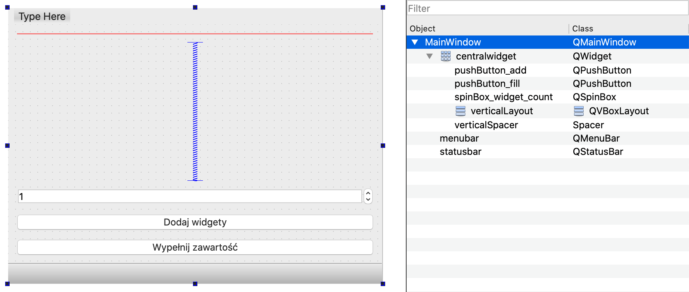

# Qt - dynamiczne układy widgetów

O ile graficzny edytor GUI w Qt Creatorze daje możliwość szybkiej i wygodnej edycji warstwy graficznej aplikacji Qt, o tyle jego użycie zakłada z góry ustalony layout okna, ze znaną liczbą i rozmieszczeniem widgetów.

Możliwe jest tworzenie okien wyłącznie z poziomu funkcji C++ biblioteki Qt, jednak wymaga to pewnego doświadczenia w użyciu biblioteki.

Rozwiązaniem pozwalającym połączyć zalety obu tych podejść jest utworzenie wstępnego layoutu okna w Qt Creatorze, z przygotowanymi miejscami na dodatkowe elementy, a następnie umieszczeniu w oknie tych elementów z poziomu kodu. Zacznijmy od utworzenia projektu aplikacji Qt Widgets, a następnie wyedytujmy plik `mainwindow.ui` korzystając z edytora graficznego:



Najważniejszym elementem jest dodany do głównego okna `verticalLayout` - miejsce, w którym będziemy umieszczać dynamicznie widgety z poziomu kodu. Oprócz tego umieszczony został minimalny interfejs, który pozwoli przetestować funkcjonalność - dwa `QPushButton`, `QSpinBox` oraz `Spacer` poprawiający rozmieszczenie interfejsu.

Do przycisków zostały dodane odpowiadające im sloty. `pushButton_add` dodaje do layoutu zadaną w `spinBox_widget_count` liczbę widgetów typu `QLineEdit`, uprzednio czyszcząc cały layout (niezbędne w przypadku kilkukrotnego wywoływania tej funkcjonalności):

```cpp
void MainWindow::on_pushButton_add_clicked() {
    // czyszczenie istniejacych widgetow w layoucie
    QLayoutItem *item;
    while((item = ui->verticalLayout->takeAt(0))) {
        if (item->widget()) {
           delete item->widget();
        }
        delete item;
    }

    // odczytujemy liczbe widgetow do utworzenia
    int widget_count = ui->spinBox_widget_count->value();

    // tworzymy widgety i dodajemy je do layoutu
    for (int i = 0; i < widget_count; i++) {
        QLineEdit* widget = new QLineEdit();
        ui->verticalLayout->addWidget(widget);
    }
}
```

`pushButton_fill` wypełnia istniejące w layoucie widgety zadanym tekstem. Przyjęte zostało założenie, że elementami layoutu są tylko `QLineEdit` - w innym wypadku należałoby sprawdzać czy `dynamic_cast<>` nie zwróciło wartości `nullptr` (co oznaczałoby, że rzutowanie było niemożliwe):

```cpp
void MainWindow::on_pushButton_fill_clicked() {
    // przegladamy wszystkie widgety w layoucie
    for (int i = 0; i < ui->verticalLayout->count(); i++) {
        QLayoutItem* item = ui->verticalLayout->itemAt(i); // wybieramy item w i-tym miejscu, w ktorym jest przechowywany widget
        QLineEdit* widget = dynamic_cast<QLineEdit*>(item->widget()); // zakladamy, ze elementami sa tylko QLineEdit
        widget->setText("Hello widget " + QString::number(i)); // wpisujemy tekst do i-tego widgetu
    }
    repaint(); // fix gdyby napisy nie odswiezyly sie samoczynnie
}
```

Oczywiście przykład można adaptować do własnych potrzeb, elementami layoutu mogą być dowolne widgety - przyciski, etykiety, wykresy itp.

Wszystkie pliki źródłowe projektu załączone są poniżej:

[dynamic_widgets.pro](_resources/dynamic_widgets/dynamic_widgets.pro)
[main.cpp](_resources/dynamic_widgets/main.cpp)
[mainwindow.cpp](_resources/dynamic_widgets/mainwindow.cpp)
[mainwindow.h](_resources/dynamic_widgets/mainwindow.h)
[mainwindow.ui](_resources/dynamic_widgets/mainwindow.ui)


***
Autor: *Jakub Tomczyński*
